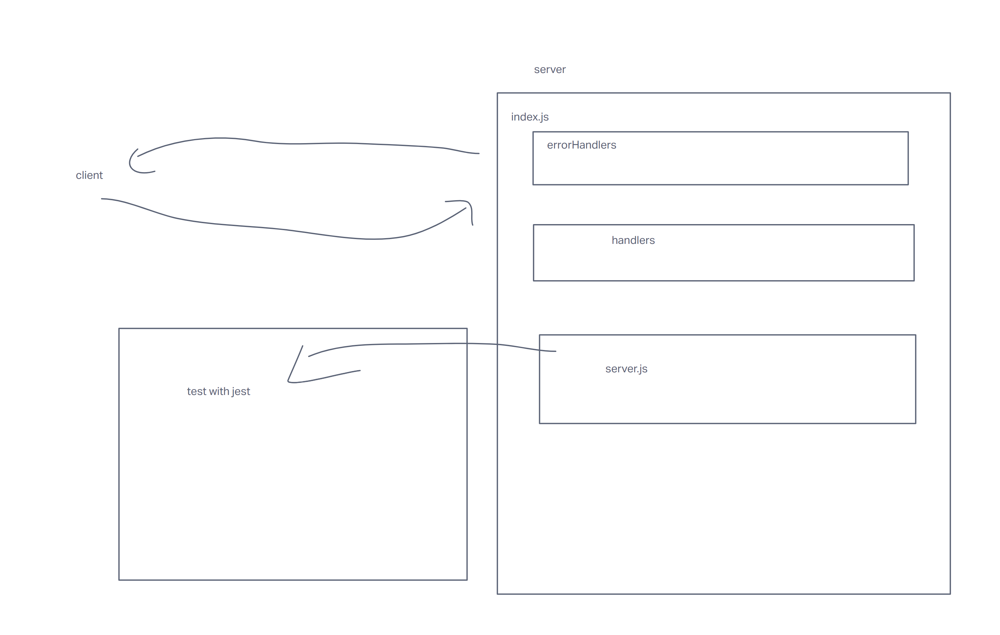

# LAB - Class 01

## Project: Server Practice

### Author: Joe Davitt

### Problem Domain

To practice server deployment

### Links and Resources

- [GitHub Actions ci/cd](https://github.com/j-davitt/server-deployment-practice/actions)
- [back-end server url](https://server-deployment-practice-95eq.onrender.com)

### Setup

#### `.env` requirements (where applicable)

for now I have none and do not require one

#### How to initialize/run your application (where applicable)

- e.g. `npm start`

#### How to use your library (where applicable)

#### Features / Routes

- Feature One: Details of feature
- GET : `/hello` - specific route to hit

#### Tests

- How do you run tests?
- Any tests of note?
- Describe any tests that you did not complete, skipped, etc

#### UML

